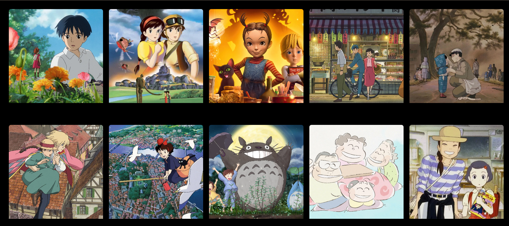
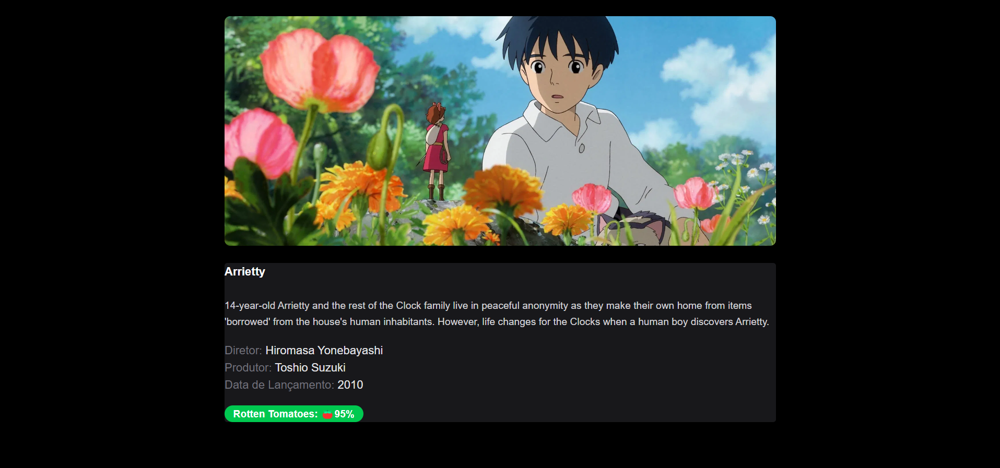

# Ghibli Movies App

Aplicação web que consome a [API pública do Studio Ghibli](https://ghibliapi.vercel.app/) para listar e exibir detalhes dos filmes do estúdio.

> Projeto desenvolvido como desafio técnico de estudo, durante a formação fullstack **Dev em Dobro**. Não é um projeto autoral do zero, mas toda a lógica, estrutura e estilização foram implementadas por mim como prática dos conceitos aprendidos.

## 🎬 Sobre o projeto

O app lista os 10 primeiros filmes do Studio Ghibli em um grid estilo Netflix. Ao clicar em um filme, o usuário acessa uma página de detalhes com mais informações, sem repetir requisições desnecessárias à API.

## ⚙️ Funcionalidades

- Listagem dos 10 primeiros filmes da API
- Página de detalhes de cada filme
- Roteamento aninhado com React Router (`Outlet`)
- Compartilhamento de dados entre páginas via Context API, evitando fetch duplicado
- Grid responsivo estilo Netflix, com efeito de hover (zoom + overlay)
- Badge dinâmico exibindo a nota do filme
- Tipagem completa em TypeScript

## 🛠️ Tecnologias

- React
- TypeScript
- React Router
- Context API
- Tailwind CSS

## 🚀 Como rodar localmente

```bash
# Clone o repositório
git clone https://github.com/marcormsilva/ghibli-movies-app.git

# Entre na pasta
cd ghibli-movies-app

# Instale as dependências
npm install

# Rode o projeto
npm run dev
```

## 📸 Preview




## 📚 Aprendizados

Este desafio foi usado para praticar consumo de API externa em conjunto com tipagem TypeScript, roteamento aninhado e gerenciamento de estado global simples com Context API.

## 🔗 Contato

- [LinkedIn](https://www.linkedin.com/in/marco-rm-silva/)
- [GitHub](https://github.com/marcormsilva)
